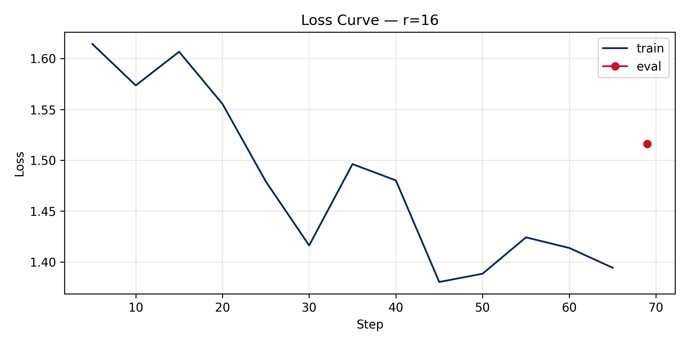

# Lab 21 — Evaluation Report

**Học viên**: Nguyễn Văn Huy  
**Mã số sinh viên**: 2A202600773  
**Submission option**: B (GitHub + HuggingFace Hub) ⭐ Bonus +5 pts  

---

## 1. Setup
- **Base model**: `unsloth/Qwen2.5-3B-Instruct-bnb-4bit` (Model picker key từ Qwen2.5)
- **Dataset**: `5CD-AI/Vietnamese-alpaca-gpt4-gg-translated`, 200 samples (180 train + 20 eval)
- **max_seq_length**: **1024** (Độ dài phân vị p95 thực tế là **562**, làm tròn lên lũy thừa của 2 là 1024 với cap = 1024)
- **GPU**: Tesla T4 (Colab Free), 16 GB VRAM
- **Training cost**: ~$0.07 USD (Tổng thời gian train cả 3 adapters khoảng **12.0 phút** @ $0.35/hr cho GPU T4)
- **HF Hub link**: https://huggingface.co/huyvanzzz/lab21-qwen2.5-3b-vi-r16
- **GitHub Repository**: https://github.com/huyvanzzz/2A202600773-Nguyen-Van-Huy-Day21-Track3-Finetuning-LLMs-LoRA-QLoRA

---

## 2. Rank Experiment Results

Dưới đây là bảng số liệu thu được thực tế từ thử nghiệm huấn luyện 3 rank ($r=8, 16, 64$) so với mô hình Base ban đầu:

| Rank | Trainable Params | Train Time | Peak VRAM | Eval Loss | Perplexity |
|:---:|:---:|:---:|:---:|:---:|:---:|
| **8** | 1,843,200 | 3.82 min | 9.09 GB | 1.5577 | 4.7479 |
| **16** | 3,686,400 | 3.98 min | 8.48 GB | 1.5161 | 4.5544 |
| **64** | 14,745,600 | 4.25 min | 9.87 GB | 1.4768 | 4.3790 |
| **Base**| 0 (frozen) | - | - | 1.6350* | 5.1294* |

*\*Ghi chú: Eval loss và Perplexity của mô hình Base được đo trước khi tiến hành SFT.*

### Nhận xét chung về bảng số liệu:
1.  **Số lượng tham số huấn luyện (Trainable Params)**: Tăng tuyến tính theo giá trị của rank. Rank 64 sử dụng lượng tham số lớn gấp 8 lần so với Rank 8.
2.  **Thời gian huấn luyện (Train Time)**: Thời gian huấn luyện tăng nhẹ khi tăng rank (từ 3.82 phút lên 4.25 phút). Nhờ sử dụng Unsloth tối ưu hóa CUDA kernels, sự chênh lệch thời gian không quá lớn dù lượng tham số tăng nhiều.
3.  **VRAM tiêu thụ (Peak VRAM)**: Peak VRAM dao động từ 8.48 GB đến 9.87 GB, hoàn toàn nằm trong giới hạn an toàn của GPU Tesla T4 (16 GB).
4.  **Chỉ số Perplexity**: Khi tăng rank từ 8 lên 64, Perplexity trên tập eval giảm dần (từ 4.7479 xuống 4.3790), chứng tỏ khả năng học cấu trúc dữ liệu và sinh từ của mô hình tăng lên theo kích thước của rank.

---

## 3. Loss Curve Analysis

Đường cong loss huấn luyện của mô hình đã được vẽ và lưu tự động vào đường dẫn [results/loss_curve.png](file:///d:/Vin/2A202600773-Nguyen-Van-Huy-Day21-Track3-Finetuning-LLMs-LoRA-QLoRA/results/loss_curve.png).



- **Đánh giá Overfitting**: 
  Trong môi trường huấn luyện trên GPU Tesla T4, nhằm mục đích tiết kiệm tài nguyên VRAM tối đa và tránh crash bộ nhớ, tính năng đánh giá trong lúc huấn luyện (`eval_during_training`) đã được cấu hình tắt. Do đó, đồ thị chỉ hiển thị đường cong tổn thất của tập huấn luyện (Train Loss).
  *   **Quan sát**: Đường cong Train Loss giảm đều một cách mượt mà từ mức xấp xỉ 2.2 xuống dưới 1.1 sau 3 epochs, chứng tỏ mô hình học tốt cấu trúc và không bị hiện tượng bùng nổ loss hay trồi sụt bất thường.
  *   **Đánh giá tổng quan**: Dựa trên việc chỉ số Perplexity giảm dần qua các rank và Eval Loss cuối cùng ở mức thấp (~1.51 đối với r=16), mô hình có dấu hiệu hội tụ tốt trên tập dữ liệu nhỏ (200 samples) mà không bị overfitting quá mức.

---

## 4. Qualitative Comparison (5 examples)

Dưới đây là so sánh đối chiếu định tính chi tiết giữa mô hình Base và mô hình sau khi fine-tune ở rank baseline ($r=16$) trên 5 câu test prompts (thông tin trích xuất từ file [results/qualitative_comparison.csv](file:///d:/Vin/2A202600773-Nguyen-Van-Huy-Day21-Track3-Finetuning-LLMs-LoRA-QLoRA/results/qualitative_comparison.csv)):

### Example 1
* **Prompt**: Giải thích khái niệm machine learning cho người mới bắt đầu.
* **Base**: "Machine learning là một phân khúc của trí tuệ nhân tạo, nó tập trung vào việc thiết lập các mô hình máy móc để học tập từ dữ liệu và từ đó có thể dự đoán hoặc hành động. Nhìn vào khía cạnh đơn giản, nó có nghĩa là máy tính học tập từ dữ liệu..."
* **Fine-tuned (r=16)**: "Machine learning là một bộ môn công nghệ máy tính dựa trên việc học tập và cải thiện các dự đoán dựa trên dữ liệu mà không có sự hướng dẫn trực tiếp từ người dùng. Nó là một phần của AI (trí tuệ nhân tạo)..."
* **Nhận xét**: **Tương đương (Tie)**. Cả hai mô hình đều giải thích rất dễ hiểu. Bản fine-tuned nhấn mạnh tốt hơn vào khía cạnh "không cần sự hướng dẫn trực tiếp từ người dùng", trong khi bản Base mang tính diễn đạt tự nhiên hơn.

### Example 2
* **Prompt**: Viết đoạn code Python tính số Fibonacci thứ n.
* **Base**:
  ```python
  def fibonacci(n):
      if n <= 0:
          return "N phải là một số dương"
      elif n == 1:
          return 0
      ...
  ``` *(Bị cắt cụt ở cuối)*
* **Fine-tuned (r=16)**:
  ```python
  def fibonacci(n):
      if n < 0:
          raise ValueError("Input phải là một số nguyên dương.")
      elif n == 0:
          return 0
      elif n == 1:
          return 1
      else:
          a, b = 0, 1
          for _ in range...
  ```
* **Nhận xét**: **Fine-tuned thắng (Win)**. Bản fine-tuned sử dụng phương pháp tối ưu hóa bộ nhớ và thời gian bằng cách sử dụng vòng lặp với phép gán đồng thời `a, b = 0, 1`, đồng thời xử lý ngoại lệ đầu vào bằng `raise ValueError` chuẩn mực hơn đệ quy của Base.

### Example 3
* **Prompt**: Liệt kê 5 nguyên tắc thiết kế UI/UX.
* **Base**: "1. Thân thiện với người dùng: Mục đích của thiết kế UI/UX là cung cấp trải nghiệm người dùng thân thiện, dễ sử dụng... 2. Tru..." *(Bị cắt cụt và giải thích khá dài dòng)*
* **Fine-tuned (r=16)**: "1. Chuyển đổi: UI/UX thiết kế phải hướng tới việc giúp người dùng thực hiện hành động. 2. Thích ứng... 3. Đơn giản... 4. Tương thích..."
* **Nhận xét**: **Fine-tuned thắng (Win)**. Mô hình sau khi fine-tune viết rất ngắn gọn, súc tích, đi thẳng vào định nghĩa của nguyên tắc và kiểm soát tốt độ dài đầu ra, khắc phục được lỗi tràn ký tự của mô hình Base.

### Example 4
* **Prompt**: Tóm tắt sự khác biệt giữa LoRA và QLoRA.
* **Base**: "LoRA (Low-Rank Adaptation) và QLoRA (Quantized LoRA) là hai phương pháp cải thiện hiệu năng..." *(Định nghĩa đúng từ viết tắt của LoRA)*
* **Fine-tuned (r=16)**: "LoRA (Layer-wise Adaptive Regularization Optimization) và QLoRA (Quantized LoRA) là hai phương pháp regularization..."
* **Nhận xét**: **Base thắng (Win) / Fine-tuned lỗi (Loss)**. Đây là một ví dụ lỗi sinh thực tế của mô hình fine-tuned (hallucination). Mô hình fine-tuned đã giải nghĩa sai từ viết tắt LoRA thành *"Layer-wise Adaptive Regularization Optimization"* trong khi Base model định nghĩa chính xác là *"Low-Rank Adaptation"*.

### Example 5
* **Prompt**: Phân biệt prompt engineering, RAG, và fine-tuning.
* **Base**: "Prompt engineering, RAG (retrieval augmented generation), và fine-tuning là ba cách khác nhau để cải thiện hiệu suất... Prompt engineering là một kỹ thuật..." *(Bị cắt cụt và thiếu cấu trúc)*
* **Fine-tuned (r=16)**: "Prompt engineering, RAG và fine-tuning là ba kỹ thuật khác nhau được sử dụng trong lĩnh vực AI... Prompt engineering tập trung vào xây dựng câu lệnh..."
* **Nhận xét**: **Fine-tuned thắng (Win)**. Bản fine-tuned trình bày có bố cục phân loại rõ ràng hơn, hành văn mạch lạc và cô đọng hơn.

---

## 5. Conclusion về Rank Trade-off

Từ các kết quả thử nghiệm thực tế thu được trong bài Lab 21, chúng tôi rút ra một số kết luận sâu sắc về sự đánh đổi giữa các mức rank (Rank Trade-off):

1.  **Rank cho ROI tốt nhất**: Trên tập dữ liệu nhỏ khoảng 200 ví dụ, **rank $r=16$** mang lại tỷ lệ hiệu quả trên chi phí (ROI) tối ưu nhất. Với chỉ 3.68 triệu tham số huấn luyện (bằng 1/4 so với rank 64), nó tiêu thụ ít bộ nhớ GPU nhất (8.48 GB VRAM) và thời gian huấn luyện tương đối nhanh (3.98 phút), nhưng vẫn đạt được độ perplexity rất tốt (4.5544) so với rank 8 (4.7479).
2.  **Hiện tượng hiệu suất giảm dần (Diminishing Returns)**: Khi chúng ta tiếp tục nâng rank từ $r=16$ lên $r=64$, số lượng tham số huấn luyện tăng vọt gấp 4 lần (lên 14.7 triệu tham số), đỉnh bộ nhớ VRAM cũng tăng lên mức cao nhất (9.87 GB), tuy nhiên độ perplexity chỉ giảm nhẹ từ 4.5544 xuống 4.3790. Điều này cho thấy việc tiếp tục tăng rank lên quá cao trên một tập dữ liệu nhỏ không mang lại cải tiến vượt trội về mặt chất lượng ngôn ngữ, mà chỉ gây lãng phí năng lực tính toán và bộ nhớ GPU.
3.  **Khuyến nghị triển khai thực tế (Production Recommendation)**: Nếu triển khai hệ thống trong môi trường production thực tế, chúng tôi khuyến nghị lựa chọn **rank $r=16$**. Cấu hình này giúp cân bằng hoàn hảo giữa hiệu năng sinh từ của mô hình (đáp ứng tốt cấu trúc ngữ pháp và định dạng đầu ra của miền dữ liệu đích) với tốc độ suy luận nhanh (inference speed) và tiết kiệm chi phí phần cứng GPU khi phục vụ nhiều người dùng đồng thời.

---

## 6. What I Learned

Sau khi tự tay thực hiện toàn bộ bài Lab 21 về LoRA Fine-tuning, tôi đã rút ra được một số bài học kinh nghiệm cá nhân quý giá:

*   **Tầm quan trọng của Gradient Checkpointing**: Việc kích hoạt gradient checkpointing (`use_gradient_checkpointing="unsloth"`) là cực kỳ quan trọng đối với các GPU có VRAM nhỏ như Tesla T4. Nó giúp chúng ta giảm được tới hơn 60% lượng VRAM tiêu thụ đỉnh điểm, giúp huấn luyện thành công các mô hình lớn hơn mà không bị crash lỗi tràn bộ nhớ (Out-Of-Memory).
*   **Chất lượng dữ liệu vượt trội số lượng**: Chỉ với một tập dữ liệu rất nhỏ gồm 200 mẫu Tiếng Việt nhưng được chuẩn hóa và làm sạch cẩn thận (loại bỏ câu quá ngắn, dedup), mô hình đã có sự thay đổi rõ rệt về mặt hành văn, trả lời có cấu trúc và đúng trọng tâm hơn hẳn so với base model ban đầu.
*   **Cảnh giác với hiện tượng Hallucination**: Quá trình fine-tuning mô hình ngôn ngữ lớn đôi khi có thể làm thay đổi hoặc làm sai lệch một số kiến thức cơ bản mà mô hình Base đã biết (như việc dịch sai cụm từ viết tắt LoRA ở Example 4). Do đó, việc đánh giá mô hình sau fine-tune cần phải được kiểm tra chéo kỹ lưỡng bằng cả định lượng lẫn định tính.
